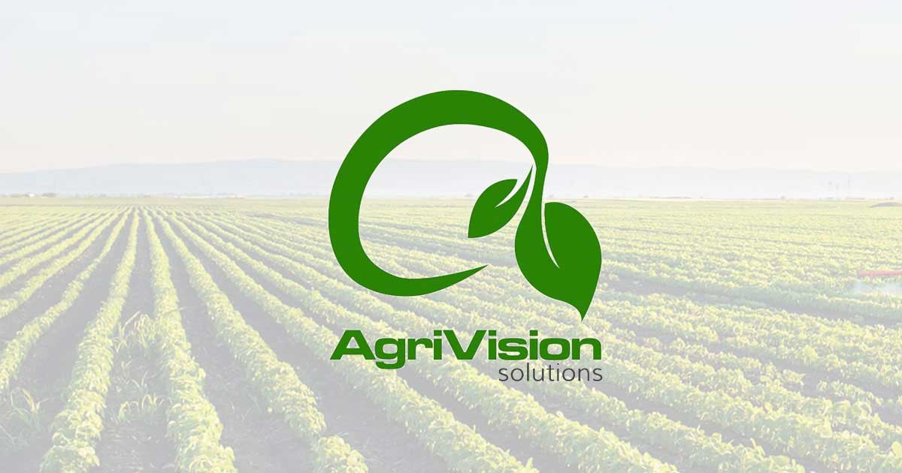

# AgriVision Pro : Réinventer l'Agriculture grâce à l'IA

## Présentation

AgriVision Pro est une application innovante qui utilise l'intelligence artificielle pour améliorer la gestion des cultures, prédire les rendements et détecter les maladies des plantes. Conçue pour les agriculteurs et les chercheurs, elle permet une surveillance en temps réel des cultures, avec des recommandations basées sur des données précises pour optimiser les récoltes et garantir une agriculture plus durable.

## Description du Projet

AgriVision Pro est conçu pour proposer des solutions efficaces à trois des plus grands défis de l'agriculture :

- **Recommandation de cultures**
- **Prédiction de rendement agricole**
- **Détection des maladies des plantes**

 *(chemin relatif à adapter)*

## Fonctionnalités Principales

### 1. Recommandation de Cultures

Le Crop Recommendation Dataset utilisé contient des informations essentielles sur les sols et les conditions climatiques pour recommander des cultures agricoles spécifiques.

**Caractéristiques utilisées :**

- **Teneur en Azote (N)** : Quantité d'azote dans le sol (kg/ha)
- **Teneur en Phosphore (P)** : Quantité de phosphore dans le sol (kg/ha)
- **Teneur en Potassium (K)** : Quantité de potassium dans le sol (kg/ha)
- **Température** : Température ambiante moyenne (°C)
- **Humidité** : Taux d'humidité de l'air ambiant (%)
- **PH du Sol** : Niveau d'acidité ou d'alcalinité
- **Pluviométrie** : Quantité de précipitations (mm)
- **Culture Recommandée** (label) : Culture la mieux adaptée

**Modèles de Machine Learning testés :**

- Random Forest
- Support Vector Machine
- K-Nearest Neighbors
- Gaussian Naïve Bayes
- XGBoost

**Meilleur modèle :** Gaussian Naïve Bayes (Précision 99 %)

### 2. Prédiction Agricole

La base de données utilisée provient de l’Organisation des Nations Unies pour l’alimentation et l’agriculture (FAO). Elle contient les rendements des dix cultures les plus consommées dans le monde.

**Caractéristiques :**

- **Area** : Pays (région du champ)
- **Item** : Type de culture
- **Year** : Année
- **hg/ha_yield** : Rendement (hg/ha)
- **average_rain_fall** : Précipitations moyennes (mm/an)
- **pesticides_tonnes** : Pesticides utilisés (tonnes)
- **avg_temp** : Température moyenne (°C)

**Modèles testés :** Logistic Regression, Random Forest, SVM, Decision Tree

**Meilleur modèle :** Random Forest  
- Erreur Quadratique Moyenne : 18.24  
- Score R² : 0.973

### 3. Détection des Maladies des Plantes

AgriVision s’appuie sur les données et technologies de PlantVillage, une plateforme de référence. Grâce à l’IA, cette fonctionnalité détecte en temps réel les maladies des plantes à partir d’images.

- **Modèle utilisé :** YOLOv5
- Entraîné sur divers jeux de données de maladies agricoles
- Classification précise des maladies à partir d’images

**Performances :** Précision 83 % – Recall 80,13 %

## Déploiement

AgriVision sera déployé via **Streamlit**, une solution légère et interactive offrant une interface utilisateur intuitive pour la détection des maladies, la prédiction des rendements et les recommandations agricoles. Les utilisateurs pourront télécharger des images de leurs cultures, obtenir des diagnostics en temps réel et accéder aux traitements recommandés, depuis une plateforme web accessible.

## Contribution

Nous accueillerons avec enthousiasme les contributions de la communauté pour améliorer AgriVision !

**Comment contribuer :**

1. **Fork** le projet
2. **Clone** ton fork en local
3. **Crée une branche** pour ta fonctionnalité/correction
4. **Fais tes modifications** (avec tests si nécessaire)
5. **Soumets une Pull Request** avec une description détaillée

**Règles :** respecte les conventions de style, inclus des tests, sois respectueux.

## Perspectives

Je compte proposer un traitement des maladies détectées par notre modèle, qu’ils soient biologiques, chimiques ou basés sur de simples pratiques agricoles, pour aider les agriculteurs à protéger efficacement leurs cultures.

## Contact

**Responsable du Projet :** DIALLO Souleymane  
**Email :** sd100615@gmail.com  
**LinkedIn :** [https://www.linkedin.com/in/souleymane-diallo-51214728b/](https://www.linkedin.com/in/souleymane-diallo-51214728b/)

## Remerciements

- Plant Village
- Roboflow

Nous apprécions chaque contribution et sommes impatients de collaborer avec vous pour transformer l’agriculture grâce à l’IA !
